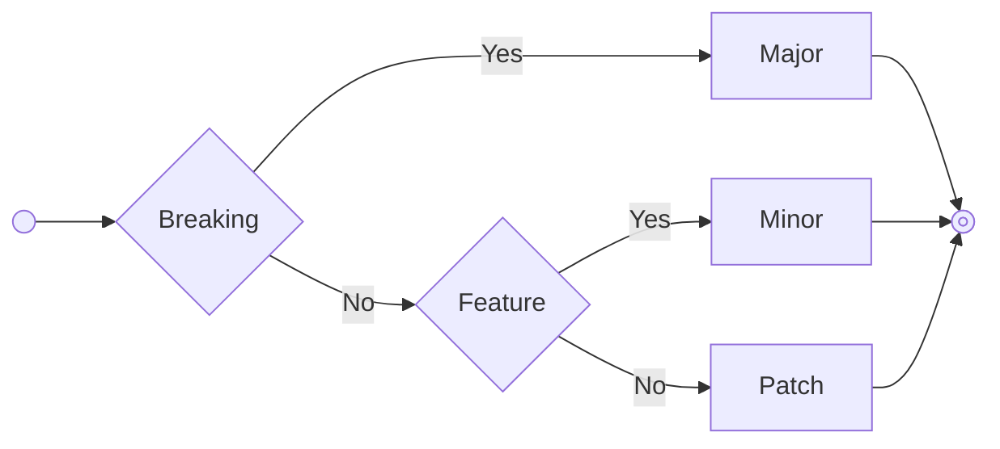

# Working on the Project

Better to be explicit/specific on topics than to wait for avoidable confusion due to ambiguity.

## Principles

1. Changes are NEVER done directly on `main`
    - ALWAYS branch off of the target receiving branch (i.e. `main` for the majority of work)
    - This allows for peer review and approval
2. All quality gates SHOULD be passed before review
    - Linting
    - Type-checking
    - Isolation testing: unit, integration, functional
    - Testing coverage thresholds
3. All changes must be reviewed and approved by another contributor
    - An author can not "approve" their own changes
    - Some areas might have [code owners](../.github/CODEOWNERS.md) assigned requiring specific people to review
    - Contributors should aim for a ratio of 1/1 (PRS reviewed/opened) or better (greater than 1)
        - I've reviewed 3 and opened 5 would be 3/5 - less than 1
        - I've reviewed 5 and opened 5 would be 5/5 - even at 1
        - I've reviewed 5 and opened 3 would be 5/3 - greater than 1

## Development Workflows

- [Starting Work](#starting-work)
- [Pipelines](#pipelines)
- [Changesets](#changesets)
- [Approvals](#approvals)
- [Local Testing](#local-testing)

### Starting Work

1. Pick a task from the issues/project
    - Ask the team if anyone is working on the task
        - Internal contributors can use the MS Teams "DevTK Devs" channel
        - External contributors can comment in the issue directly
    - Assign yourself to the task
2. Create a branch off of the target receiving branch (i.e. `main`)
    - `feat/___` - for feature work
    - `fix/___` - for hotfix work
    - Replace "___" with a hyphenated brief title of the task
3. Commit changes and push the branch
    - If changes are being made to `src/*` files or "config" for artifact output a [Changesets](#changesets) is required.
        - `pnpm changeset`
        - Follow the prompts to create the changeset file for your changes.
    - Follow the conventions of [Conventional Commits](https://www.conventionalcommits.org/en/v1.0.0/) for the final commit of the branch.
    - Keep the branch current; i.e. click the "Update Branch" button in the GitHub UI.
4. Open a Pull Request to the [central repository](github.com/gohypergiant/standard-toolkit) for review
    - Add "close|closed|closes|fixed|fixes #12345" to the optional footers of a commit message; e.g. the example would close issue #12345.
5. Merge
    - Authors merge PRs when all quality gates are met, reviewers have approved, and the author is ready to merge.
    - The [Pipelines](#pipelines) will take over from here.
    - Merging will be blocked by branch protections

### Pipelines

See the [GitHub Actions](../.github/workflows/).

### Changesets

#### [Semver](https://semver.org/)

Given a version number MAJOR.MINOR.PATCH, increment the:

1. MAJOR version when you make incompatible API changes
    - Clients/users would be required to adjust due to "breaking" changes
    - Increment the `MAJOR` version number and reset `MINOR` and `PATCH`
    - Can include `MINOR` and `PATCH` updates
2. MINOR version when you add functionality in a backward compatible manner
    - Clients/users would NOT be required to adjust their use
    - Increment the `MINOR` version number and reset `PATCH`
    - Can include `PATCH` updates
3. PATCH version when you make backward compatible bug fixes
    - Clients/users would NOT be required to adjust their use
    - Increment the `PATCH` version number and reset no values



### Approvals

Approvals should focus on:

- (Doing the right things) Business logic
- (Doing things right-ly) Established modules or patterns
- (Doing things performant-ly) Performance

*As often as possible style should be left to the linter and the author.*

### Local Testing

Testing your changes before pushing a branch is important. Testing only what you are working on will help with feedback cycles; but keep in mind that changes in one area may have effects in other areas. During fast feedback cycles it is helpful to use "filtering" to only test the area you are working in:

```$ pnpm --filter=@accelint/module test -- --watch```

Once you reach milestones it is also a good idea to test more broadly to make sure your changes aren't having negative affects on the broader project:

```$ pnpm test```
