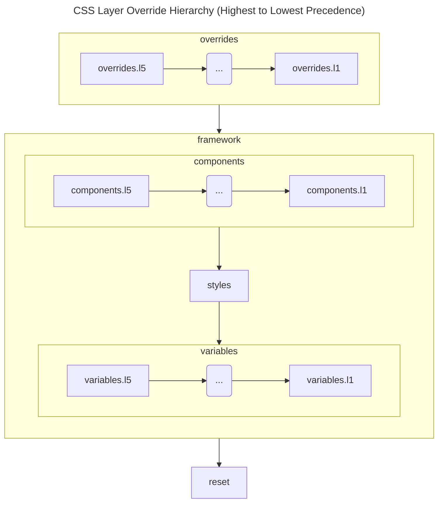

<!-- Copyright 2025 Hypergiant Galactic Systems Inc. All rights reserved.
This file is licensed to you under the Apache License, Version 2.0 (the "License");
you may not use this file except in compliance with the License. You may obtain a copy
of the License at https://www.apache.org/licenses/LICENSE-2.0
Unless required by applicable law or agreed to in writing, software distributed under
the License is distributed on an "AS IS" BASIS, WITHOUT WARRANTIES OR REPRESENTATIONS
OF ANY KIND, either express or implied. See the License for the specific language
governing permissions and limitations under the License. -->

# Concepts

## Core Technologies

C2DS is built on top of two core packages:

### [Vanilla Extract](https://vanilla-extract.style/documentation/getting-started/)

Vanilla Extract (VE) is the style engine. It provides an API of utilities that create build/compile time CSS styles. It is fairly generic and unopinionated so we built our style-based tooling on their API. Being a Typescript-based package means that we have type safety and a single consistent language across our codebase.

[Learn](./theming) more about how we use theming with VE.

### [React Aria](https://react-spectrum.adobe.com/react-aria/getting-started.html) and [React Stately](https://react-spectrum.adobe.com/react-stately/index.html)

React Aria components (RAC) & React Stately is a vast collection of hooks and components that provide a wealth of common functionality. C2DS is built mostly on top of the headless components, but the entire suite is a collection of peer dependencies that can be used to quickly establish custom functionality. RAC generally have a 1:1 relationship with a single DOM element to make composition more intuitive. They publish with an underlying DOM structure and the wiring in place to handle state and behavior, but no styling.

> **Note**: React Spectrum is a design system built by the same group, based on the same underlying packages, but is not to be used in or with C2DS. It can be a little disorienting since the React Aria components and the React Stately libraries are housed under the collection they call the "React Spectrum Libraries" -- but "React Spectrum" itself is a full-featured implementation that is at odds with our use cases.

## Styling

Beyond what VE provides us, it's important to understand the underlying features of CSS and the abstractions we've built on top of them.

### Build and runtime

The VE style code is bundled and generated at compile time via a Vite plugin that has the handy characteristic of importing and bundling only those styles that are referenced. When a style is imported, we receive the scoped class name that was generated and also mark that style for inclusion in the bundling.

While creating all styles at build time may feel like it's a step backwards from CSS-in-JS solutions, it has distinct advantages:

- No runtime style injection performance overhead
- Reduce JS bundle size (styles are delivered as plain CSS)

Considering the dynamic nature of styles in a highly interactive application, it is necessary to have the runtime means to adjust styles. C2DS opts to utilize [CSS variables](https://developer.mozilla.org/en-US/docs/Web/CSS/Using_CSS_custom_properties), [layers](https://developer.mozilla.org/en-US/docs/Web/CSS/@layer) and [container queries](https://developer.mozilla.org/en-US/docs/Web/CSS/CSS_containment/Container_queries) to provide an expressive syntax that:

- Avoids selector specificity conflicts
- Allows complete access to internal component state and any other arbitrary state
- Establishes clear cascading order style precedence
- Provides runtime, dynamic style changes based on state or other conditionals without any of the runtime performance cost

### Contracts and CSS variables (AKA custom properties)

VE establishes a concept of [contracts](https://vanilla-extract.style/documentation/api/create-theme-contract/), which are typed, nested objects of CSS variables that will be provided a value (either at build time or runtime). Conceptually, the contract is an interface definition that can have many concrete implementations. The contract defines the shape only, without values, and leaves the implementation and assignment of CSS vars to be fulfilled later.

We utilize these contracts in multiple ways:

- For design tokens to be used in theming (globally and at the component level)
- As the basis for [container-style queries](https://developer.mozilla.org/en-US/docs/Web/CSS/@container#container_style_queries)
- To enable extraction of contract values from the DOM into the React rendering scope

### Layers

[CSS @layer](https://developer.mozilla.org/en-US/docs/Web/CSS/@layer) provides a structured approach to manage style cascading, avoiding the complexities of selector specificity. The layers hierarchy is established up front in C2DS within [layers.css.ts](https://github.com/gohypergiant/standard-toolkit/blob/main/packages/design-system/src/styles/layers.css.ts).

The layers here are ordered, with the lowest precedence to highest.

- **reset:** Establishes a baseline over browser defaults.

- **framework:** The parent layer for variables, framework global styles, and components.

  - **variables:** Sets theme variables without overriding system styles. Variables also have levels of additional specificity. The higher the number, the more specific the style will be - meaning `l2` styles override `l1` styles, and `l3` styles override both `l1` and `l2` styles and so on.
  - **styles:** Global styles (typography, elevation, etc.)
  - **components:** Design system component styles. There are levels of additional specificity the same as variables.

- **override:** Parent layer for application-specific style overrides, level rules the same as variables.

> **Note:** Styles assigned to parent layers will override any children. Because of this, we recommend not using parent layers directly in assignments. Rather, use the `.l*` level of specifity when assigning CSS.

[Live Editor Version](https://mermaid.live/edit#pako:eNqNU7FOwzAQ_RXrJpCSKEkTaDMwQIcORSDKhLKY-NpYJHblOJRQ9d9xE2o3lZDwdPf87t3z2d5DIRlCBr7v50JzXWFGHlYrsqQdKvL0iUpxhmTBUVFVlB25WvBNiY0mWpKl3B2jZ4UFMhQFXueiF1pXcleUVGnyOs8FMatp3zeKbksifyWbAT8uxo2A5lKQ5YtDLTGoUuL7dw54MU2vgiC4HsNBFQ3VKNhF07WiNe6k-rDyrufrvQUt_5MqTt-rc5N_uHTUk00LjG2eEyNbb62O2hey3kqBQv-jv-OeDDhk7OCc6RyMLThOX9LobjSEIR8f82LmChvUQ2hvpi-4uAOb9puuCjyoUdWUM_Mq90coB11ijTlkJmTUCEAuDoZHWy1XnSgg06pFD5RsNyVka1o1Jmu3jGqcc2pmWlt0S8WblKMcsj18QeZPZmkQReFNHN3O0nQWxR50kCVRMInSOIlvJsk0TpPpwYPvXiEOwlmYJkkcT26naRKGiQfIuJbqcfhT_dc6_AApoQtt)



### Container Queries

[Container queries](https://developer.mozilla.org/en-US/docs/Web/CSS/CSS_containment/Container_queries) allow styles to be dynamically applied based on component state. This approach minimizes the need for predefined state combinations, letting the theme control the level of detail to which the component is customized. Container queries are similar to media queries in that they define boundary conditions where certain styles should be applied. They are a more flexible tool than media queries, however, since you can query for both container size as well as the presence of certain css vars. In C2DS, the state of a component is made available in the container as a css var (i.e. `--is-Pressed`) which means we can use those vars to dynamically assign styles to any container.

[Learn](./container-queries.md) more in-depth about how to write container queries.

### Theme

Theming in C2DS consists primarily of writing styles with container queries in order to populate/fulfill the token contracts of a given component. The values that are being passed into component contracts can either be hardcoded or references to values from global contracts. The global contracts that define domains of style, such as color, space, and typography, are pre-populated with default values but can be completely or partially customized with styles passed to the `<ThemeProvider/>`.

[Read](./implementation) more about implementation.
[Learn](./theming) more in-depth about how to establish a theme.

## React

### Render props

The React Aria components (RAC) lean on the [render props pattern](https://www.patterns.dev/react/render-props-pattern/). A render prop is a prop whose value is a function that returns a JSX Element, used as a callback in the parent component. RAC uses this pattern to pass down props used to render based on the current state. As a simple example to illustrate:

```tsx
<Button>
  {({ isPressed }) => (
    <>
      {isPressed && <PressHighlight />}
      Press me
    </>
  )}
</Button>
```

### "Normal" Props

Components can all receive props in the standard way passed directly or through the render props pattern. However, there are two other ways for a component to receive props: via default props and context.

#### Default Props

Default props is a pattern C2DS establishes to enable global changes to the defaults of components within. If a default prop on a component isn't what the application implementor wants to be the default, they can provide that change to the DefaultsProvider and the component will now have that new value as its default.

#### Context

Unlike most applications where context is provided almost exclusively at a global level and consumed towards the leaves of the component tree, RAC establishes a pattern of micro implementations of context as described by Context Props, Slots and Composition.

##### Context props

Context props is a pattern established by RAC which is used widely for composition. Many components will establish a unique context that is based on its props. This allows the component to consume props from a parent that expects this component to be composed inside of itself. The parent composes the values passed into the provider and any children then have access to those values as consumers of context.

##### Slots

RAC establishes a pattern of [slots](https://react-spectrum.adobe.com/react-aria/advanced.html#slots), where a parent provides props on a given context with multiple named slots. Then when a component that consumes the matching context and includes the slot prop with a matching value (to the one of the slot names), then that component will receive the provided props on that slot. This is a means to disambiguate different context values for composed children when there are multiple children of the same component type composed together.

[Learn](./implementation#slots) how this applies in an implementation.

##### Composition

One of the goals of this design system is to move away from mega, do-it-all components. By utilizing composition instead, each component is able to remain much more focused and concise. It also means that there's more flexibility in the end implementation since the composed components only need to adhere to specific interfaces to be compatible. Each component or style declares the interface it needs to behave correctly, but the application (or composition context) is responsible for the concrete expression of that interface.

#### Merging props

Whenever multiple sets of props for a component are received, the props go through a merging process. C2DS extends the standard merging process that [RAC establishes](https://react-spectrum.adobe.com/react-aria/mergeProps.html) by also handling the merge of render props, classNames and styles.

Event handlers are merged by chaining them in the order they were merged so that they are called with the same props sequentially. Ids are simply merged by being deduplicated. `className` is merged with `clsx` while `classNames` are deep merged by merging each property on the object with `clsx`. For context props merged via the `useContextProps()` hook, local props (and refs) are merged with the ones provided via context by a parent component. The local props always take precedence over the context values.

For all other props, the last prop object overrides all previous ones.
