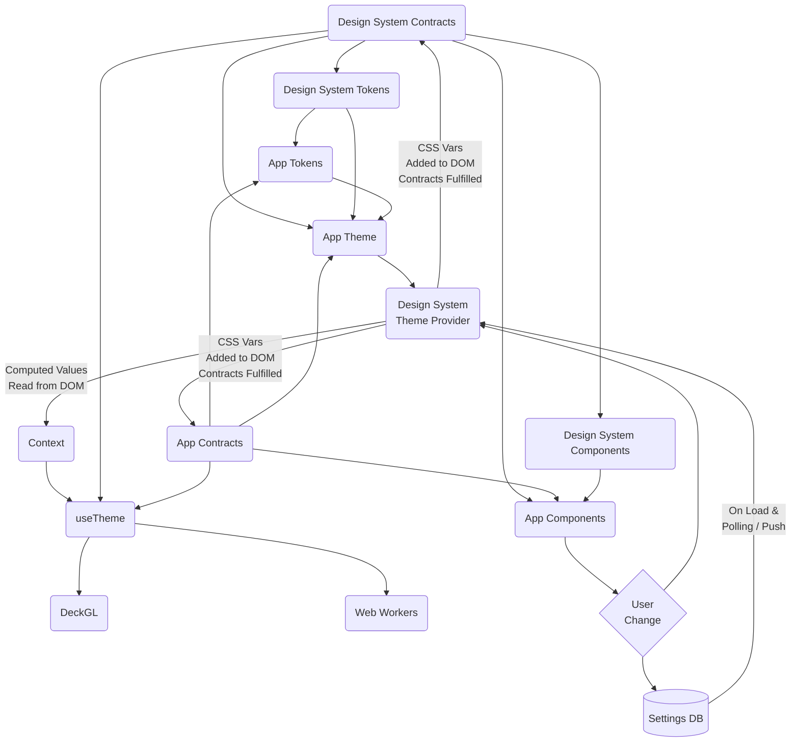

<!-- Copyright 2025 Hypergiant Galactic Systems Inc. All rights reserved.
This file is licensed to you under the Apache License, Version 2.0 (the "License");
you may not use this file except in compliance with the License. You may obtain a copy
of the License at https://www.apache.org/licenses/LICENSE-2.0
Unless required by applicable law or agreed to in writing, software distributed under
the License is distributed on an "AS IS" BASIS, WITHOUT WARRANTIES OR REPRESENTATIONS
OF ANY KIND, either express or implied. See the License for the specific language
governing permissions and limitations under the License. -->

# Theming

This design system integrates flexibility and customization, enabling dynamic adaptation of component styles through a combination of tokens, contracts, and modern CSS features. It emphasizes a scalable approach to styling that adapts to various states and themes within an application.

## `*.css.ts`

Files with the `.css.ts` extension are processed by Vanilla Extract. This ensures strong typing and maintainability by enforcing specific export rules and enabling CSS to be written with TypeScript. Refer to the [Vanilla Extract: create-a-style](https://vanilla-extract.style/documentation/getting-started/#create-a-style) for more details.

## Tokens & Contracts

Tokens define essential design values such as colors, sizes, and typography. Derived from the N2X design system, they are customizable at both theme and runtime levels, allowing adaptation to specific needs.

Contracts structure tokens by mapping property names to CSS variables. This approach facilitates consistent theming and seamless styling integration across an application.

- **Customizability:** Tokens can be dynamically adjusted for real-time theme changes.
- **Interoperability:** Contracts support both direct styling and the Design System `useTheme()` hook. When retrieved via `useTheme()`, values are automatically converted to suitable formats (e.g., RGB(A) for colors, numbers for sizes).

> **Note:** `useTheme()` RGB(A)'s `alpha` is converted to values 0-255 for compatability with DeckGL.

```tsx
export const componentColorVars = createThemeContract({
  background: '',
  color: '',
});

export const componentSpacingVars = createThemeContract({
  gap: '',
  margin: '',
});
```

**Instanced CSS Variables:** CSS variables are scoped to their instances, allowing the use of variables from multiple components in a single query without needing a container target.

## Creating Alternative Themes

All of the global theme contracts come with default values, but feel free to override some or all values. To create alternative themes, call `createTheme()` again with the existing theme contract and new values.

```tsx
import { createTheme } from '@vanilla-extract/css';
import { sizeVars, defaultSizesVarValues } from '@cbc2/c2-design-system';

export const extendedSizeClass = createTheme(sizeVars, {
  ...defaultSizesVarValues,
  v10: '160px',
});
```

```tsx
function App() {
  return (
    <ThemeProvider vars={{ size: extendedSizeClass }}>
      <YourComponent />
    </ThemeProvider>
  );
}
```

By passing the existing theme contract, the CSS variables are reused but assigned new values within a new CSS class.

## Updating CSS Variables at Runtime

```ts
// theme.css.ts

import { createTheme } from '@vanilla-extract/css';
import { sizeVars, defaultSizesVarValues } from '@cbc2/c2-design-system';

// partial theme contract update
export const compactSizeClass = createTheme(sizeVars, {
  ...defaultSizesVarValues,
  v10: '120px',
});

// full theme contract update
export const roomySizeClass = createTheme(sizeVars, {
  none: '0',
  v01: '2px',
  v02: '4px',
  v03: '8px',
  v04: '16px',
  v05: '24px',
  v06: '32px',
  v07: '48px',
  v08: '80px',
  v09: '160px',
  v10: '240px',
});
```

```tsx
import { compactSizeClass, roomySizeClass } from 'theme.css.ts';

function App() {
  const [sizeTheme, setSizeTheme] = useState(compactSizeClass);

  const handleToggleSizeTheme = () => {
    setSizeTheme(
      sizeTheme === compactSizeClass ? roomySizeClass : compactSizeClass
    );
  };

  return (
    <ThemeProvider vars={{ size: sizeTheme }}>
      <button onClick={handleToggleSizeTheme}>Toggle Size Theme</button>
      <YourComponent />
    </ThemeProvider>
  );
}
```

```tsx
import { useState } from 'react';
import { inlineVars, genericColorVars } from '@cbc2/c2-design-system';

function App() {
  const [highlightColor, setHighlightColor] = useState();

  const handleUserSettingUpdate = (color: string) => {
    setHightlightColor(color);
  };

  return (
    <ThemeProvider
      style={inlineVars(genericColorVars, {
        highlight: { primary: { v3: highlightColor } },
      })}
    >
      <YourComponent onUserSettingUpdate={handleUserSettingUpdate} />
    </ThemeProvider>
  );
}
```

## Nested Theming

If a portion of your application needs to `inherit` and modify the theme contract.

```tsx
import { compactSizeClass, roomySizeClass } from 'theme.css.ts';

function App() {
  return (
    <ThemeProvider vars={{ size: roomySizeClass }}>
      <YourComponent>
        <ThemeProvider inherit vars={{ size: compactSizeClass }}>
          <YourNestedComponent />
        </ThemeProvider>
      </YourComponent>
    </ThemeProvider>
  );
}
```

The general flow of how contracts are utilized to define the shape of tokens, how tokens are populated and used to fulfill contracts, contracts are used to style components, and how user changes to tokens can be propagated across rendering technologies: [Live Editor Version](https://mermaid.live/edit#pako:eNp1VF1vmzAU_SuWHyoikTQQaBM0VWqDtpdOjUbWSmv64IYbQAEbGbM1jfLfZ2PchIg8-fiec78t7_GaxYADvMnZv3VKuEDLcEURCqM5o4KTtaisEKosoSjaVQIK9GUfoOHwTgqXbAv0XKWNg7NQjcd9WS5TKMCSADWoV6buRcko0J4SDHEpwYmrynLm0AhMd5rv9KQq1E01JR5bOXXs9KLL0MpuiF7GuHypehmFzYwVXnD2N4uBd6fx7Z2j6zstNop2LB0vGQnNowg9E15pn_s4hhgJhsKnn9pybO57nW-yPJe82YVhrjpTuJRIDrwW0vuZ5DW0-X4BidGGs0IlbOKqMPAhrPZsym5xw_-uQD-VugW9-zaq3g2dkgbrnmC9_fFo6WMg23qB9xfGt8ArS0LU4ot7P74pU5O59ys6BlMan6eEJrBXsF1BYzi05bZ83yvoUUQgREaTKnx4tQxG4cPgTWmPpFrQE0WPTK7jSmddsDyXJLpGi7pK-9JhGxfAC5LF8rfYq4ArLJrB4kDCmPDtCq_oQepILVi0o2scCF6DjesyJgLCjCScFDjYkLyS1pLQP4x17jjY4w8cDCczf-Q44xvXuZ35_sxxbbzDgeeMJo7veu7NxJu6vjc92PizieCOxrOx73muO7md-t547NmYszpJ2-CH_8akn8M)


