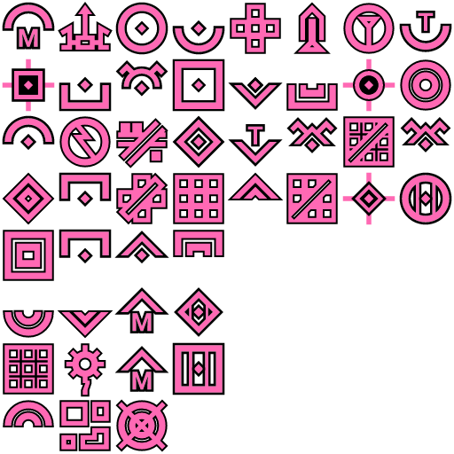
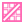
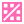
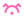
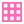
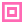
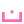
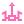
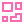
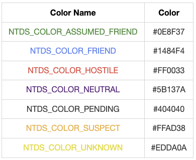

# @accelint/ntds

An NTDS-compliant offering of a set of SVG Icon Components with fill color inputs for general usage, and a spritesheet for icons to be used in the COP.

## Installation

```shell
npm install @accelint/ntds
```

## Background

This package contains two sets of output: a spritesheet for icons for the CBC2 COP, and a core set of colorable React SVG Components.

### Spritesheet

The first group is the set of masked icons that are used solely in the COP. These reside in [./icons/masked](./icons/masked). Since they will only be used as part of the deckGL rendering, these are combined into a spritesheet under [./dist/masked](./dist/masked/).



### React SVG Core Components

The second group is a set of icons to be used anywhere needed in a React app as an SVG component, colored as needed. The source icons come from [./icons/core](./icons/core/). The first section of this set adhere to a minimal set of icons for `Hostile`, `Friendly` and `Unknown`.

| Category          |                             Hostile                              |                            Friendly                            |                             Unknown                              |
| ----------------- | :--------------------------------------------------------------: | :------------------------------------------------------------: | :--------------------------------------------------------------: |
| Air               |                      |                      |                      |
| Air Base          |            |            |            |
| Air Group         |          |          |          |
| Helicopter        |        |        |        |
| Missile           |              |              |              |
| Base              |                    |                    |                    |
| Carrier           |              |              |              |
| Land              |                    |                    |                    |
| Surface           |              |              |              |
| Surface Group     |  |  |  |
| Sub-Surface       |      |      |      |
| Sub-Surface Group |  |  |  |
| Torpedo           |              |              |              |

The next section is a simple generic icon for any color variety.

| Category                            |                      Generic                       |
| ----------------------------------- | :------------------------------------------------: |
| Communications                      |  |
| Mine Field                          |          |
| Petroleum, Oil and Lubricants (POL) |                        |
| Port                                |                      |
| Runway                              |                  |
| Surface to Air Missile (SAM)        |                        |
| Structure                           |            |
| Target                              |                  |

The color variants are defined in [./src/constants.ts](./src/constants.ts).



<!-- 

|                           Color Name                           |  Color  |
| :------------------------------------------------------------: | :-----: |
| <span style='color:#0E8F37'> NTDS_COLOR_ASSUMED_FRIEND </span> | #0E8F37 |
|     <span style='color:#1484F4'> NTDS_COLOR_FRIEND </span>     | #1484F4 |
|    <span style='color:#FF0033'> NTDS_COLOR_HOSTILE </span>     | #FF0033 |
|    <span style='color:#5B137A'> NTDS_COLOR_NEUTRAL </span>     | #5B137A |
|    <span style='color:#404040'> NTDS_COLOR_PENDING </span>     | #404040 |
|    <span style='color:#FFAD38'> NTDS_COLOR_SUSPECT </span>     | #FFAD38 |
|    <span style='color:#EDDA0A'> NTDS_COLOR_UNKNOWN </span>     | #EDDA0A |

-->
