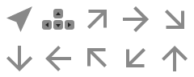

# @accelint/smeegl

A small, `spreet` based spritesheet/texture package for use with Deck.gl.

## Prerequisites

The [spreet](https://github.com/flother/spreet?tab=readme-ov-file#installation) utility is required for this tool.

A few options for install include:

### Homebrew

```shell
brew install flother/taps/spreet
```

### crates.io

```shell
cargo install spreet
```

### Other methods

If those two methods aren't available, check the [official instructions](https://github.com/flother/spreet?tab=readme-ov-file#installation) for more help.

### Standalone binary

Use the `--spreet` flag to point to a stand-alone binary.

## Installation

Here are a few options:

- For global installation: `npm install -g @accelint/smeegl`
- For local installation using npm: `npm install @accelint/smeegl`
- For local installation using pnpm: `pnpm install @accelint/smeegl`

## Usage

```shell
smeegl --help

Usage: smeegl

  Example 1: Using a base folder. Note, the '~/' is a valid input.

    > smeegl --in ~/exported_icon_set_1 --out ~/react_svg_set_1 --target REACT
    > smeegl --in ~/exported_icon_set_2 --out ~/react_svg_set_2 --target SPRITESHEET

  Example 2: Using a glob pattern. Note, the '~/' is not a valid input for a glob pattern.

    > smeegl --glob "/Users/me/exported_icon_set_3/**/*.svg" --out ~/react_svg_set_3 --target REACT
    > smeegl --glob "/Users/me/exported_icon_set_4/**/*.svg" --out ~/react_svg_set_4 --target SPRITESHEET


CLI tool to create spritesheets and React Components from an SVG glob pattern or base folder of SVG files

Arguments:
  GLOB             [DEPRECATED] SVG glob pattern
  OUTPUT           [DEPRECATED] The atlas output path, CWD if none given

Options:
  --spreet <path>  Path to pre-built spreet binary, unneeded if installed (default: "spreet")
  --crc <MODE>     Sprite names will be converted to crc32, either DEC or HEX (choices: "DEC", "HEX")
  --glob <glob>    SVG glob pattern
  --in <path>      The input path to scan for svg files
  --out <path>     The output path, CWD if none given
  --target <TYPE>  Spritesheet or React files (choices: "SPRITESHEET", "REACT", default: "SPRITESHEET")
  -h, --help       display help for command
```

## Script Output

There are two options for output: a spritesheet and supporting files, and a folder of React SVG Component files.

The sample icons use for these examples are a set of arrows:

```shell
❯ tree ./assets
./assets
├── arrow-down.svg
├── arrow-keys.svg
├── arrow-left.svg
├── arrow-northeast.svg
├── arrow-northwest.svg
├── arrow-right.svg
├── arrow-southeast.svg
├── arrow-southwest.svg
├── arrow-up.svg
└── arrow.svg
```

<p align="center" width="100%">
    
    
    
    
    
    
    
    
    
    

</p>

### Spritesheet Output

On successful completion, three files will be generated (assume the default name `atlas` is used):

- `atlas.json` - The sprite's index file
- `atlas.png` - The sprite's image file
- `atlas.ts` - A file of exported constants that are available for the application

For this example:

```shell
❯ tree ./assets
~/assets
├── samples.json
├── samples.png
└── samples.ts
```

- `samples.png` - Spritefile

<p align="center" width="100%">
    
</p>

- `samples.json` - Index file

```json
{"arrow":           {"height":48, "pixelRatio":2, "width":48, "x":0, "y":0},
 "arrow-down":      {"height":48, "pixelRatio":2, "width":48, "x":0, "y":48},
 "arrow-keys":      {"height":48, "pixelRatio":2, "width":48, "x":48, "y":0},
 "arrow-left":      {"height":48, "pixelRatio":2, "width":48, "x":48, "y":48},
 "arrow-northeast": {"height":48, "pixelRatio":2, "width":48, "x":96, "y":0},
 "arrow-northwest": {"height":48, "pixelRatio":2, "width":48, "x":96, "y":48},
 "arrow-right":     {"height":48, "pixelRatio":2, "width":48, "x":144, "y":0},
 "arrow-southeast": {"height":48, "pixelRatio":2, "width":48, "x":192, "y":0},
 "arrow-southwest": {"height":48, "pixelRatio":2, "width":48, "x":144, "y":48},
 "arrow-up":        {"height":48, "pixelRatio":2, "width":48, "x":192, "y":48}
}
```

- `samples.ts` - Constants file

```ts
/**
 * THIS IS A GENERATED FILE. DO NOT ALTER DIRECTLY.
 * Generated by smeegl.
 */

export const ARROW = 'arrow'
export const ARROW_DOWN = 'arrow-down'
export const ARROW_KEYS = 'arrow-keys'
export const ARROW_LEFT = 'arrow-left'
export const ARROW_NORTHEAST = 'arrow-northeast'
export const ARROW_NORTHWEST = 'arrow-northwest'
export const ARROW_RIGHT = 'arrow-right'
export const ARROW_SOUTHEAST = 'arrow-southeast'
export const ARROW_SOUTHWEST = 'arrow-southwest'
export const ARROW_UP = 'arrow-up'
```

### React SVG Component Files

The `out` parameter is used as a base folder name for a set of SVG files that are [built off of a template](./src/utils/merge-svg-into-react-template.ts). The algorithm will merge a working SVG file into the template for the React SVG component, massage the attributes from `kebab-case` to `camelCase` as appropriate, and add a section for `<title>...</title>`.  Also, the assumption is the icon will have a single `fill` color. The fill color embedded in the raw SVG file is assumed to be '#FF69B4', though any fill value that is not `none` will be replaced with the input parameter of the React component.

- Output folder:

```shell
❯ tree ~/Downloads/react/samples
~/Downloads/react/samples
├── arrow-down.tsx
├── arrow-keys.tsx
├── arrow-left.tsx
├── arrow-northeast.tsx
├── arrow-northwest.tsx
├── arrow-right.tsx
├── arrow-southeast.tsx
├── arrow-southwest.tsx
├── arrow-up.tsx
├── arrow.tsx
└── index.ts
```

For a generic example of a built component:

```tsx

/**
 * THIS IS A GENERATED FILE. DO NOT ALTER DIRECTLY.
 */

import type { SVGProps } from 'react';
interface Props {
  title?: string;
  titleId?: string;
}
export const SvgArrow = ({
  title,
  titleId,
  ...props
}: SVGProps<SVGSVGElement> & Props) => {
  const { fill } = props;
  const fillColor = fill ?? '#FF69B4'
  const hasTitle = typeof title === 'string' && Boolean(title.trim());

  return (

    <svg xmlns="http://www.w3.org/2000/svg" width="24" height="24" viewBox="0 0 24 24" fill="none">
      <path d="M19.9997 4L18.5053 4.68873L5.46423 10.6149L4.00024 11.2722L5.36522 11.8256L10.2042 13.7955L12.1736 18.635L12.727 20L13.3844 18.536L19.3105 5.49499L19.9997 4Z" fill={fillColor} />
    </svg>
  )
};

```

... and the corresponding `index.ts` file:

```ts
export { SvgArrowDown } from './arrow-down';
export { SvgArrowKeys } from './arrow-keys';
export { SvgArrowLeft } from './arrow-left';
export { SvgArrowNortheast } from './arrow-northeast';
export { SvgArrowNorthwest } from './arrow-northwest';
export { SvgArrowRight } from './arrow-right';
export { SvgArrowSoutheast } from './arrow-southeast';
export { SvgArrowSouthwest } from './arrow-southwest';
export { SvgArrowUp } from './arrow-up';
export { SvgArrow } from './arrow';
```

## Source SVG Directory structure

The GLOB root path will be used as a base point for prefix information for the exported constant definitions. If there are no folders inside the GLOB path, then the names will be simply the names of the file. Otherwise, a common path will be determined, and the prefix will be prepended in order to guarantee uniqueness in the file.  

### Character replacements and name normalization

- The generated sprite's definition file should export all of the constants using [CONSTANT_CASE](https://stringcase.org/cases/constant/).
- The generated sprite's index file should use [SNAKE_CASE](https://stringcase.org/cases/snake/) for each of the JSON properties.
- The following rules are applied to the directory and file names in order to achieve the desired casing:
  - The directory separator and any spaces in the folder names will be replaced with a single underscore `_`.
  - Parentheses are removed.

For example:

```shell
> tree ./icons

icons
├── group1
│   ├── a.svg
│   ├── b.svg
│   ├── c.svg
│   ├── d.svg
│   └── e.svg
└── group2
    ├── x
    │   ├── a2_2112.svg
    │   ├── b2_2112.svg
    │   └── c2_2112.svg
    └── y
        ├── b2_2112.svg
        ├── c2_2112.svg
        ├── d2_2112.svg
        └── e2_2112.svg

# Build the two sets of sprite files
> smeegl "./tree/group1/**/*.svg" "group1"
> smeegl "./tree/group2/**/*.svg" "group2"
```

This will generate the two sprite constants files.  Obviously, the svg names should be something more substantial.

```ts
/*
  group1.ts

  The most common folder is `icons/group1`.
  Since group1 has no sub-folders. the exported constants are simply the filename roots.
  
*/
export const A = 'a';
export const B = 'b';
export const C = 'c';
export const D = 'd';
export const E = 'e';
```

```ts
/*
  group2.ts

  The most common folder is `icons/group2`.
  Since group2 does have sub-folders, the sub-folders will be used as part of the file prefix. 
*/

export const X_A2_2112 = 'x_a2_2112';
export const X_B2_2112 = 'x_b2_2112';
export const X_C2_2112 = 'x_c2_2112';
export const Y_B2_2112 = 'y_b2_2112';
export const Y_C2_2112 = 'y_c2_2112';
export const Y_D2_2112 = 'y_d2_2112';
export const Y_E2_2112 = 'y_e2_2112';
```

### TODO

- [ ] Allow using a config file
- [ ] Allow multiple svg globs
- [ ] Allow searching in npm packages for svg's
